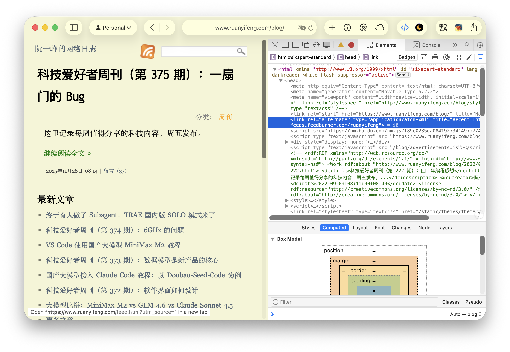
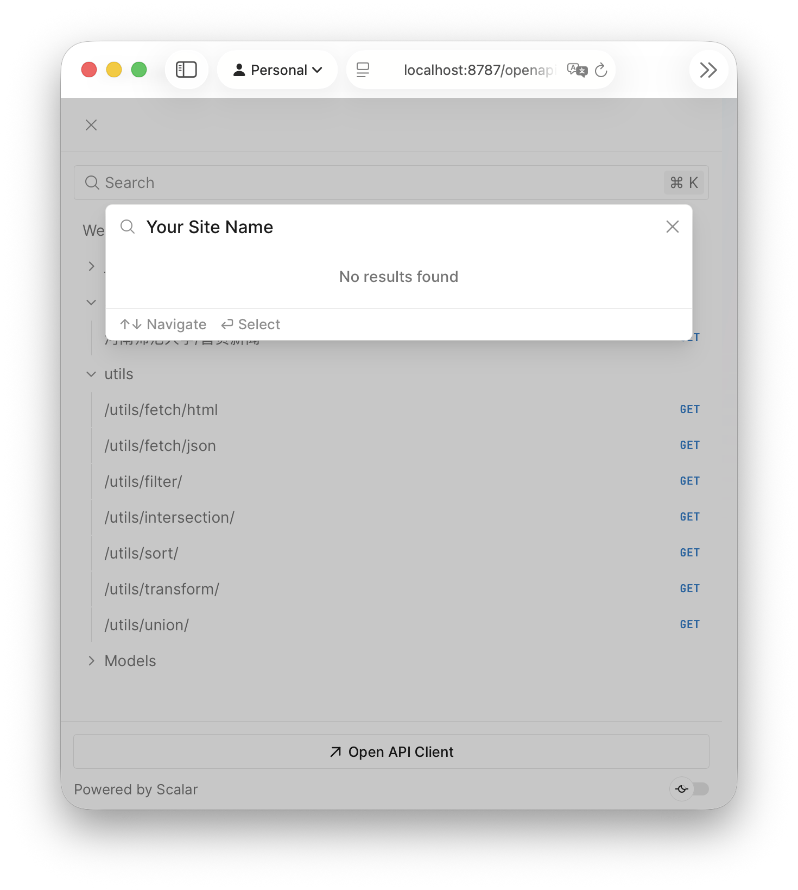
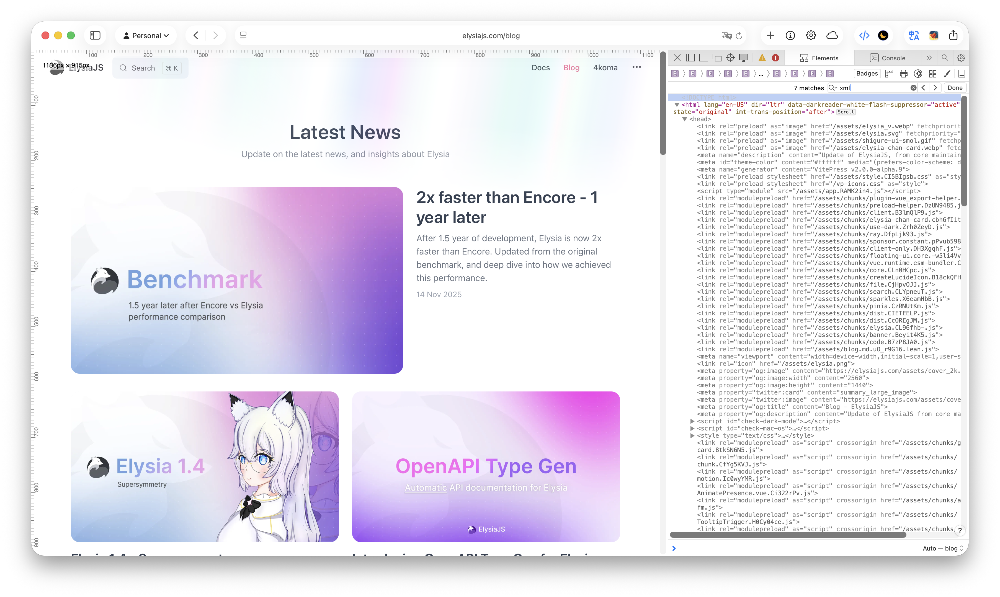
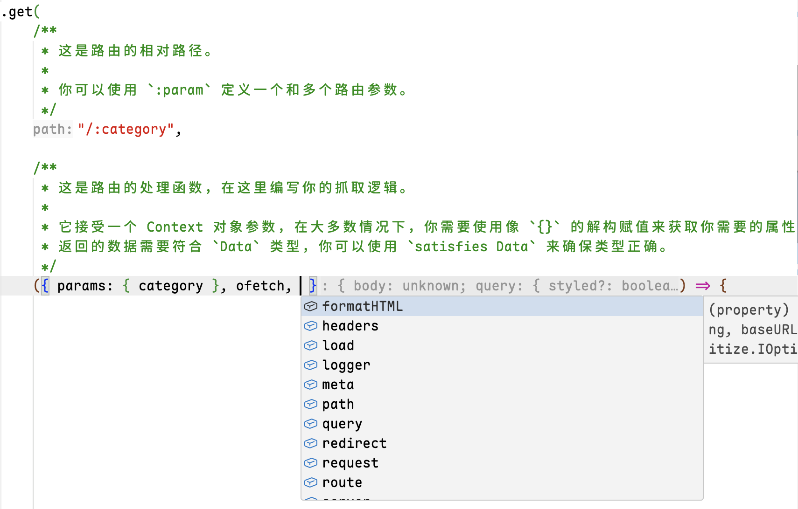
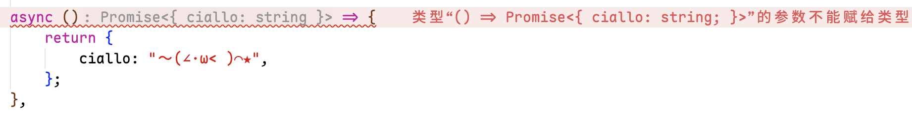
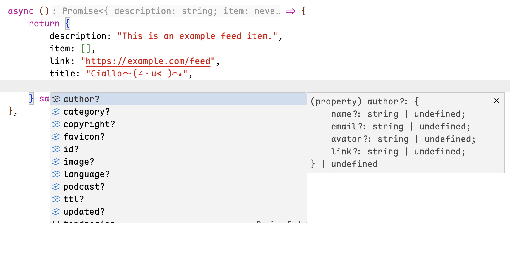
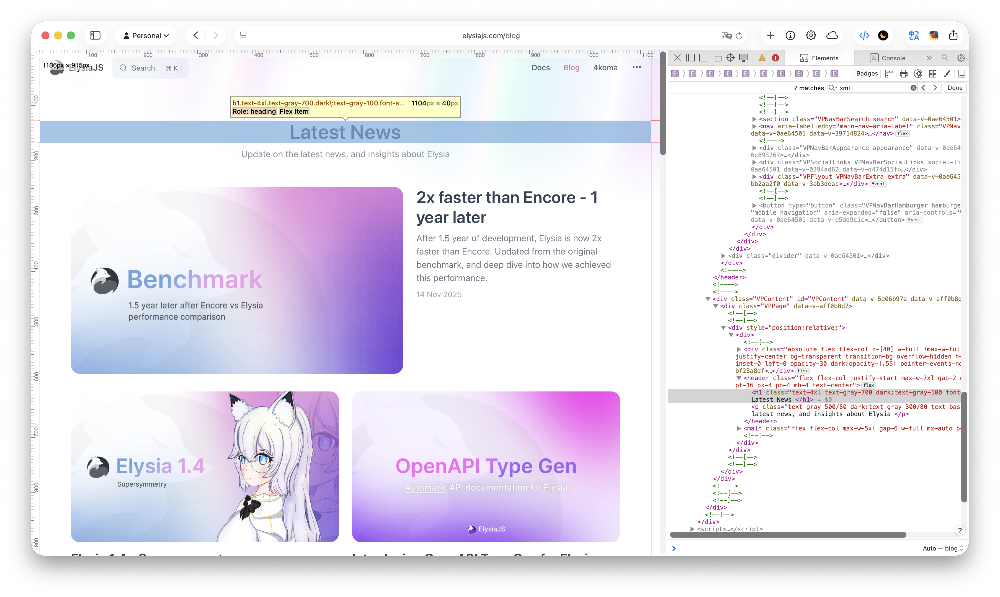
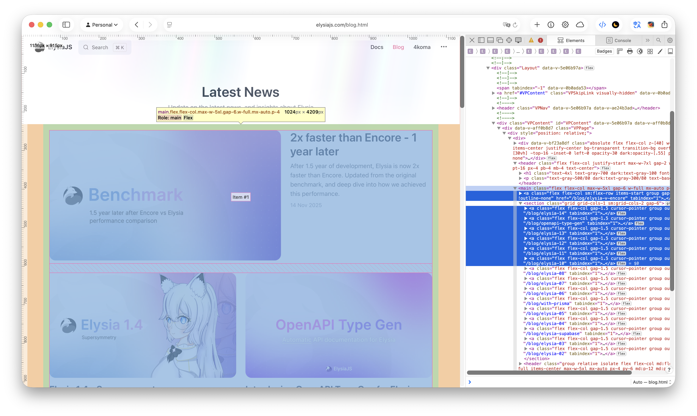

## Adding a New Feed

> This document is translated by AI.

This guide will walk you through creating a real, usable Feed and submitting it to the RSSBook project.

### Quick Start

The prerequisite for creating a Feed via RSSBook is that the website does not have an existing Feed.

There are many ways to check if a website has a Feed, such as looking for the Feed icon in the header or footer of the website, checking the `<head>` section of the website's source code for links pointing to a Feed, or using a search engine to search for "Website Name + RSS/Atom/JSON Feed".



If the website already has a Feed, please use the existing Feed directly. RSSBook should always be your fallback plan when you cannot find a Feed.

Then you need to determine if the website is already in RSSBook's route list. You can visit the OpenAPI documentation to query if your target website already has relevant routes.



In RSSBook, each website is a `Source`, and each `Source` can contain multiple `Feed` routes. If your website already has a `Source` but lacks the `Feed` route you want, you only need to add a new `Feed` route to that `Source`. If not, you need to create a new `Source`.

Next, you need to clone the repository and install the RSSBook development environment. This part is detailed in [README.md](./README.md).

#### Create a Source

As mentioned before, each website is a `Source`, and each `Source` can contain multiple `Feed` routes. If your target website does not yet have a corresponding `Source`, you need to create a new `Source` first.

Enter the project directory, and you can run the helper command to create a new `Source`:

```bash
bun run source:new
```

This will start a CLI to guide you through the process of creating a `Source`.

You need to choose a category, and then name the `slug` for your `Source`. The naming of the `Source` is recommended to use the website's domain name or a short identifier, consisting only of lowercase letters, numbers, and hyphens (`-`), and cannot contain spaces or other special characters.

> [!TIP]
>
> Generally, you can use the website's first-level domain as the `slug`, for example, `google.com.hk` can be named `google`.

> [!CAUTION]
>
> Once the category and `slug` are determined, they cannot be **easily changed** (unless in special cases like website migration or renaming), because this will affect all route paths.

After creation, an `index.ts` file will be generated in the `src/routers/feeds/{category}/{slug}` directory. You need to **delete the comments** and modify the `Source` metadata according to your needs, such as the title, a slightly short description, site link, etc. This information can be obtained in the `Feed` and displayed in RSSBook's documentation, so please ensure they are accurate.

Finally, you need to register your `Source` in the `index.ts` file under the category folder so that RSSBook can recognize and load it.

The example Feed we are making is the Elysiajs Blog (https://elysiajs.com/blog.html). ElysiaJS is a lightweight Web framework running in the Bun environment.



We have searched this page and found no existing Feed, so we decided to create a new Feed for it. We can put it under the `updates` category, name the `slug` as `elysiajs`, so we create a new folder `elysiajs`, which contains an `index.ts` file, exporting a `Source` by default.

```ts
// updates/elysiajs/index.ts
import { Source } from "@/utils";

export default new Source({
	description: `ElysiaJS is a lightweight web framework that runs on Bun.`,
	domain: "elysiajs.com",
	slug: "elysiajs",
	title: "elysiajs",
})
```

Don't forget to register your `Source` in the category:

```ts
// updates/index.ts
import { Category } from "@/utils";

import elysiajs from "./elysiajs";

export default new Category(
	"updates",
	"**Announcements and updates** about products, services, or projects.",
)
	.use({
		/// ...other sources
		elysiajs
	});

```

#### Write Feed Logic

After creating the `Source`, you need to add one or more `Feed`s to that `Source`.

Adding a `Feed` is always a [method chaining](https://en.wikipedia.org/wiki/Method_chaining) operation. Most of the time, you only need to edit the `index.ts` file.

> [!TIP]
>
> You can move reusable logic and functions to a separate folder, such as `{slug}/type/activity.ts`, and then import and use them in `index.ts`.

```ts
import { Source } from "@/utils";

export default new Source({
	/* ...source metadata */
})
	.feed(/* ... */); // Add a Feed
	.feed(/* ... */); // Method chaining to add another Feed
```

We have a new method `.feed(config, handlerFn): this` for adding a new `Feed` route.

`config` is similar to before, you need to supplement the `Feed` metadata, such as title, description, etc.

You can use `config.description` to describe the function and purpose of the Feed **as detailed as possible**, and also describe the defined route parameters, etc. You can use Github Markdown syntax to write the description content. For more Github Markdown syntax, please refer to the [GitHub Official Documentation](https://docs.github.com/en/get-started/writing-on-github/getting-started-with-writing-and-formatting-on-github/basic-writing-and-formatting-syntax).

However, this time, you need to add yourself to be a maintainer. You need to add your **Github username**, and you can also add a brief introduction, email, or your own blog link so that we can thank you.

`handlerFn` is where you write the Feed logic, which is the most important part. It is a function that accepts an `app` parameter.

You can refer to the `elysiajs update` Feed we defined below:

```ts
export default new Source({/* ...config */})
	.feed(
		{
			description: "Update on the latest news, and insights about ElysiaJS.",
			fulltext: true,
			language: "en-US",
			maintainer: {
				name: "RSSBook",
			},
			title: "Latest News",
			withImage: "If-Present",
		},
		app => app.get(path, handler, schema?),
	);
```

We need to add **a GET route** for `app` (because all Feeds are GET methods), in the form of `app => app.get(path, handler, schema?)`.

`path` is the path of the Feed. Define a static route in the form of `/path`, or define a route parameter in the form of `/:param` to make it a dynamic route.

> [!TIP]
>
> The selection of routes, such as route names, static routes, and dynamic routes, is something you need to consider.
>
> All Feed paths should have the prefix `/feeds/{category}/{source-slug}`, followed by the `path` you defined.
>
> If your target website is a **single-user website, and there are no other pages, no categories/tags, etc.**, you can directly use `/` as the path for the home page Feed.
>
> If your target website **has multiple users, categories, or tags**, you can create more than one Feed. The first is the home page Feed with `/` as the path, and the second you can use dynamic route parameters to get categories or tags in the Feed, such as `/user/:username` or `/category/:category`.
>
> If your target website **has multiple separate pages**, you can also use static routes to create a separate static route for each page, such as `/news`, `/sports`, etc.
>
> After defining the route, you can view the route information in the OpenAPI documentation.

Because we want to create a Feed for `https://elysiajs.com/blog`, we can define `path` as `/blog`.

```ts
.feed(
	{/* ...config */},
	app => app.get(
		"/blog",
		async () => {
			// ...logic

			return data;
		},
	),
);
```

`handler` is the route handler function, where you write your scraping logic. It is usually an asynchronous (`async` marked) arrow function that returns a data object conforming to the `Data` type.

It accepts a Context type parameter. In most cases, you need to use [**destructuring assignment**](https://developer.mozilla.org/docs/Web/JavaScript/Reference/Operators/Destructuring) like `{}` to get the properties you need.

In this object, you can destructure some properties and methods to facilitate writing Feed logic, such as accessing the metadata defined just now, using utility functions to help you write Feed logic more conveniently. These utility functions are defined in `src/utils`.

> [!CAUTION]
>
> Do not import specific utility functions from `@/utils`, destructure and get them directly from the `Context` object.

In destructuring assignment, you can use the intelligent completion function of VSCode or other editors (usually moving the cursor after the parameter and pressing `Ctrl` + `Space`) to see what properties and methods are available, or hover the mouse (or cursor) over a property or method to view its type information and documentation.



---
Some commonly used properties and methods include:

Properties
- `params`
	Object for accessing route parameters.

	If you defined parameters in the route path, such as `/category/:category`, you can access the value of that parameter by destructuring `params: { category }`. 
	
	In addition, you also need to define the schema of the parameter in the `schema` of `app.get(path, handler, schema)` so that RSSBook can verify the correctness of the request parameters.

- `lang`
	Access the language of the current request.

	If you are writing a Feed for a multilingual website, the `Accept-Language` in the HTTP header will be parsed as a language code preference. You can use this property to get the language code of the current request to provide different content for users of different languages.

- `meta`
	Access the `Source` metadata.

	You should use `domain` in `meta: { domain }` to construct the request URL to ensure the correctness of the request.

	If you have set up a configuration, you can access these configuration options via `meta: { config }`.

- `logger`
	Logging tool.

	You can use it to record debug information, error messages, etc., to help you debug and troubleshoot problems.

	```ts
	logger.info("This is an info message");
	logger.warn("This is a warning message");
	logger.error("This is an error message");
	```

Functions
- `ofetch(url, options?)`
	Encapsulated network request tool.

	It is based on `ofetch` and presets some commonly used options, such as some request headers, retries, and timeouts.

	The simplest usage is usually like this:

	```ts
	app.get(
		"/category/:category",
		async ({ params: { category }, meta: { domain }, ofetch }) => {	
			
			const html = ofetch(`https://${domain}/category/${category}`, {
				responseType: "text", // or 'json', 'blob', etc.
			});

		},
		{ /* ...schema */ }
	);
	```

> [!IMPORTANT]
>
> Do not use `fetch`, use `ofetch` instead of native `fetch`. You should use this method for network requests in any case.
> 
> `ofetch` **throws an error on non-HTTP 200 responses**, and you need to use `try catch` to handle this error yourself.

- `date(date, timezone?): Date`
	Date parsing tool.

	It can parse some simple **relative time and absolute time strings**, or a Timestamp, and return a `Date` object.

	The `timezone` parameter is an optional UTC Offset string, for example, China Standard Time is `+8`.

```ts
const date1 = date("2 hours ago"); // Parse relative time
const date2 = date("2023-10-01 12:00:00", "+8"); // Parse absolute time, with timezone
const date3 = date(1696156800000); // Parse timestamp
```

- `formatHTML(html, baseURL?, options?): string`
	HTML formatting tool.

	It will clear styles, scripts, and unnecessary attributes from the HTML string.

	Some websites use **relative paths** for resources like images/videos. You can specify a base URL via the `baseURL` parameter to convert relative paths **to absolute paths**.

```ts
const rawHTML = $("article").html();
const formattedHTML = formatHTML(rawHTML, "https://example.com");
```

> [!IMPORTANT]
>
> All HTML content should be formatted using this method to ensure content security and consistency.

- `load(content, options?)`
	HTML parsing tool.

	It is based on `cheerio` and allows you to use jQuery-like syntax to parse and manipulate HTML content.

	First, you need to pass an HTML string as the `content` parameter, and then you can use the returned `CheerioAPI` object to query and manipulate HTML.

	Usually, you pass the HTML string to the `load` method and assign it to `$`, and then use `$(cssSelector)` to select elements.
	
```ts
const html = ofetch(`https://${domain}/category/${category}`);
const $ = load(html);

const title = $("title").text(); // Access text content
const href = $("a").attr("href"); // Access attribute
const items = $("article").html(); // Access HTML content

$("div.article")
	.toArray() // Convert to array
	.map((elem) => {
		const $elem = $(elem);

		const title = $elem.find("h2.title").text();
		return { title };
	})
	.filter((item) => {
		return !!item.title;
	});

```

> [!CAUTION]
>
> CSS selectors are not `XPath`. When using CSS selectors, please ensure the correctness of the selector. Some websites may use dynamically generated class names or IDs, which may cause the selector to fail.
>
> You can use the browser's developer tools to assist you in writing CSS selectors (right-click on the element and select "Inspect", then select "Copy" -> "Selector", but the browser gives the selector path not the exact selector, you need to remove or supplement some selectors to pinpoint some elements). For more information on CSS selectors, please refer to [MDN Documentation](https://developer.mozilla.org/docs/Web/CSS/Guides/Selectors).

- `sleep(ms): Promise<void>`
	Asynchronous delay waiting tool.

	In some cases, you may need to add a delay between requests, such as to avoid triggering the target website's anti-scraping mechanism. You can use this method to implement delay waiting.

```ts
await sleep(2000); // Wait for 2 seconds
```

- `toAbsoluteURL(url, base): string`
	Convert to absolute URL tool.

	It can convert a relative (or absolute) URL to an absolute URL string.

```ts
const absoluteURL = toAbsoluteURL("/path/to/resource", "https://example.com");
```

- `uuid(...input?): string`
	Unique identifier tool.

	It helps you generate reproducible unique UUIDs. If you pass one or more `input` parameters, it will generate a reproducible UUID based on `JSON.stringify(input)`. If no parameters are passed, it will generate a random UUID.

```ts
const id1 = uuid(); // Random UUID
const id2 = uuid("Tung", "Tung", "Tung", "Sahur"); // UUID generated based on input
```

> [!TIP]
> 
> Since this document may become outdated over time, a better way is to read the type annotations in `src/utils/*.ts` files and the JSDoc comments of functions to understand the latest usage of each utility function.
---

Okay, that's a lot of talk, but you don't need to understand everything completely. When you use the CLI to create a new `Source`, a basic template will be generated. You only need to modify this template according to your target website.

> [!TIP]
>
> You can refer to the example code in the `src/router/feeds/_example/` directory. These codes demonstrate how to use various utility functions to write Feed logic, including examples of scraping data via API and HTML pages.

The data returned by the arrow function just now needs to **conform to the `Data` type of `@/types`** (the actual file is in `src/types/data.ts`), otherwise a type error will be prompted.



You can use `return {/* ... */} satisfies Data` (instead of `as`) to specify the type and use intelligent completion to ensure the type is correct.



Let's go back to the `elysiajs` Feed example just now. We need to scrape the article list on the `https://elysiajs.com/blog` page and return a data object conforming to the `Data` type.

First, we construct the URL string. We can use cache to scrape the page content, and then use the `load` method to parse the HTML content.

```ts
app => app.get(
	"/blog",
	async ({
		// props
		meta: { domain }, 

		// functions
		cache,
		load,
		ofetch,
	}) => {
		const rootURL = `https://${domain}`;
		const url = `${rootURL}/blog`;

		const lists = await cache.tryGet(url, async (url) => {
			const html = await ofetch(url, { responseType: "text" });
			const $ = load(html);
		});
	},
);
```

Next, you need to open the developer tools, analyze the page structure, and find the CSS selectors for information such as title, link, publication time, and content. You can use `Meta + Shift + C` (Mac) or `Ctrl + Shift + C` (Windows/Linux) to open the element selector of the developer tools, and then click on the element on the page to view its HTML structure.



This page only shows the title and introduction. We need to judge and avoid automatically generated `class` and `id` to select the appropriate selectors. We see that the title is in `header h1` and the introduction is in `header p`.

```ts
app => app.get(
	"/blog",
	async ({
		// props
		meta: { domain }, 

		// function
		cache, // cache is a cache, you can use it to store and reuse data to avoid repeated scraping
		date, // date parses date strings and returns a Date object
		toAbsoluteURL, // toAbsoluteURL converts relative URLs to absolute URLs
		formatHTML, // formatHTML is an HTML formatting tool
		load, // load parses HTML and returns a jQuery-like parser
		logger, // logger is a logging tool, you can use it to record logs
		ofetch, // ofetch is an enhanced fetch function
	}) => {
		const rootURL = `https://${domain}`;
		const url = `${rootURL}/blog`;

		const lists = await cache.tryGet(url, async (url) => {
			const html = await ofetch(url, { responseType: "text" });
			const $ = load(html);

			const title = $("header h1").text().trim();
			const description = $("header p").text().trim();
		});
	},
);
```

Then, we need to get the article list. We need to find a selector that fits all articles.



Here, we see that the first article is `main > a`, and other articles are `main > section > a`, so we can use `main > a, main > section > a` as the selector to get all articles. Then convert them to an array and use the `map` method to traverse each article element.

```ts
const html = await ofetch(url, { responseType: "text" });
const $ = load(html);

const title = $("header h1").text().trim();
const description = $("header p").text().trim();

const items = $("main > a, main > section > a")
	.toArray()
	.map((elem) => {
		const $elem = $(elem);

	});
```

Then we extract the title, link, and publication time of each article, filter out items without links. We can destructure `toAbsoluteURL` and `date` methods from the `Context` object to help us handle links and dates.

```ts
const rootURL = `https://${domain}`;
const url = `${rootURL}/blog`;

const data = await cache.tryGet(url, async (url) => {
	const html = await ofetch(url, { responseType: "text" });
	const $ = load(html);

	const title = $("header h1").text().trim();
	const description = $("header p").text().trim();

	const items = $("main > a, main > section > a")
		.toArray()
		.map((elem) => {
			const $elem = $(elem);

			let image = $elem.find("img").attr("src");
			if (image) {
				image = toAbsoluteURL(image, rootURL);
			}

			const title = $elem.find("h2").text().trim();
			const description = $elem.find("p").text().trim();

			let link = $elem.attr("href");
			if (link) {
				link = toAbsoluteURL(link, rootURL);
			} else {
				return null; // Filter out items without links
			}

			const dateString = $elem.find("time").attr("datetime") || "";
			const pubDate = date(dateString);

			return {
				date: pubDate,
				description,
				image,
				link,
				title,
			} satisfies DataItem;
		})
		.filter((item) => item !== null); // Filter out items without links

	return {
		description,
		item: items,
		link: url,
		title,
	} satisfies Data;
```

We successfully scraped the article list and returned a data object conforming to the `Data` type. The next step is to scrape the full text. Since there are many articles in the list, we should scrape and cache the content of each article concurrently. If the request fails, we can fall back to the article containing only the introduction.

So we construct a `Promise` array containing all article contents, and then use `Promise.all` to execute these requests concurrently.

```ts
const rootURL = `https://${domain}`;
const url = `${rootURL}/blog`;

const data = await cache.tryGet(url, async (url) => { /* ... */ });

const promises = data.item.map(async (item) => {
	const link = item.link;

	return cache.tryGet(link, async (link) => {
		try {
			const html = await ofetch(link, { responseType: "text" });
			const $ = load(html);

			let content = $("article").html();
			if (content) {
				item.content = formatHTML(content, rootURL);
			}

			return item; // Return item with full text
		} catch {
			logger.error(`Failed to fetch article content: ${link}`);
			return item; // Return original item
		}
	})
})

const item = await Promise.all(promises);
return item;
```

Then, you can open the local development environment and test if your Feed works correctly in the OpenAPI documentation opened in the browser (usually `localhost:8787/openapi`, displayed in the console at startup). If your Feed has route parameters, you can add parameters to the path for testing.

If everything is ok, you should be able to see the expected Feed data.

Then, if you defined dynamic route parameters just now, you need to add a **Schema** for the Feed you just defined so that RSSBook can verify the correctness of request parameters and response data.

The third parameter `schema` of the `app.get(path, handler, schema)` method we just mentioned is used to define the schema, which is an object.

If we defined a dynamic route parameter `/:category` just now, we need to add a schema definition for this parameter, using `params` as the key of the object, and then use the `t` tool to define the type of the parameter.

```ts
import { Source, t } from "@/utils";

app.get(
	"/category/:category",
	handler,
	{
		// Define the schema of the parameter
		params: t.Object({
			category: t.UnionEnum(["news", "sports", "entertainment"], {
				description: "The category of articles to fetch.",
				example: ["news"],
			}),
		}),
	}
)
```

> [!TIP]
>
> The `t` tool is built based on [TypeBox](https://github.com/sinclairzx81/typebox), providing a simple way to define and validate data structures.
>
> You will find that all values of the object are the results of `t.*` method calls. These methods are used to define different types of data, such as strings, numbers, booleans, arrays, enumerations, etc.
>
> If possible, when defining route parameters, you can use the second parameter to add a short description within 50 words to display in the OpenAPI documentation. If your parameter is hard to understand or very long, **please add more detailed description information in `config.description` of `.feed(config, handlerFn)`**.

If everything is fine, your Feed should be displayed correctly in the OpenAPI documentation, and parameter validation should also work normally.

#### Testing

After you finish writing the Feed logic, you need to test if your code works correctly.

You can run the helper command to add or run tests for your Feed.

```bash
bun run source:test
```

It will query the changes since the last commit, and then check if there are corresponding tests in the `Source` of these changes. If not, it will prompt you to create a basic test.

### Submit Your Changes

Before this part, you need to have a GitHub account. You need to Fork the RSSBook repository on GitHub, and then push your local changes to **your own repository**.

After that, please read the **Routing Rules** section carefully to ensure that your Feed meets the requirements, including naming conventions, metadata correctness, and writing tests.

Next, you need to use the code formatting tool to check and format your code.

```bash
bun run
```

After that, you can submit your changes to your own repository.

```bash
git add .
git commit -m "feat: add new feed for {Website Name}"
git push origin main
```

After that, you need to go to the RSSBook repository and create a Pull Request to submit your changes to the main repository of RSSBook.

> [!CAUTION]
>
> Each Pull Request can only have changes for one `Source`. If you have changes for multiple `Source`s, please create a separate Pull Request for each `Source`.

### Advanced

The above tutorial can guide you to create a small Feed completely, but RSSBook also supports more advanced features. In the following sections, we will introduce some advanced features.

When you reach this part, you may already have a certain understanding of RSSBook. If you want to write more complex Feeds, these features will be helpful to you.

When writing more complex logic, you may find that the `index.ts` file may be a bit too long. At this time, what you need is to separate them. Generally speaking, you can establish some conventional subfolders, such as `utils`, `plugins`, and `types`, etc., and then put relevant logic into these folders.

**We recommend that you only write route logic in the `index.ts` file, and put other helper functions and types into subfolders**. However, if your Feed is really too complex, you can indeed separate `handlerFn` into a separate file.

We created a convenient type `Source.AppType<Source>`, you can extract the `handlerFn` of `source.feed(config, handlerFn)` to the outside, but don't forget to export `source` as default.

```ts
const handlerFn = (app: Source.AppType<typeof source>) => app.get("/", async () => {
	// ...logic

	return data;
});

const source = new Source(/* ... config */)
	.feed(/* ...config */, handlerFn);

export default source;
```

#### Add Multi-language Support

If your target website supports multiple languages, you can add multi-language support for your Feed. When users request different languages (we use request headers to judge), return content in different languages.

The `ctx.lang` property can help you get the language code of the current request. You can return content in different languages based on this language code.

Most multilingual websites just add a language parameter or path prefix to the URL. You can scrape content in different languages by constructing different URLs based on this parameter or prefix.

```ts
const rootURL = `https://${domain}`;
const langPath = lang.includes("zh") ? "zh" : "en";
const url = `${rootURL}/${langPath}/home`;
```

#### Add Configuration

If your Feed needs to provide some configuration options, such as API keys, usernames and passwords, etc., you can add configuration support.

These configurations are defined in `Source`, passed in when `RSSBookApp` is initialized, and then you can access these configuration options via `ctx.meta.config`.

Your configuration name should consist of your Slug name in uppercase plus an underscore, for example, the configuration name for `google` can be `GOOGLE_CONFIG`.

```ts
config: {
	GOOGLE_EXAMPLE_APIKey: {
		default: "Bearer 123-456-7890",
		description: "RSSBook APIKey",
		required: true,
	},
},
```

#### Add Middleware

RSSBook's routing is built based on the [ElysiaJS](https://elysiajs.com/) framework. You can add middleware to your Feed to perform some operations before or after request processing.

```ts
app => app
	.use(middleware)
	.get(path, handler, schema?);
```

### Examples

We provide some real templates in the `src/router/feeds/_example/` directory. You can copy and modify them directly to create new `Source` and `Feed`.

At the same time, querying Feed logic written by predecessors is also a good way to learn. Here, thanks to all developers who have contributed code to RSSBook.
